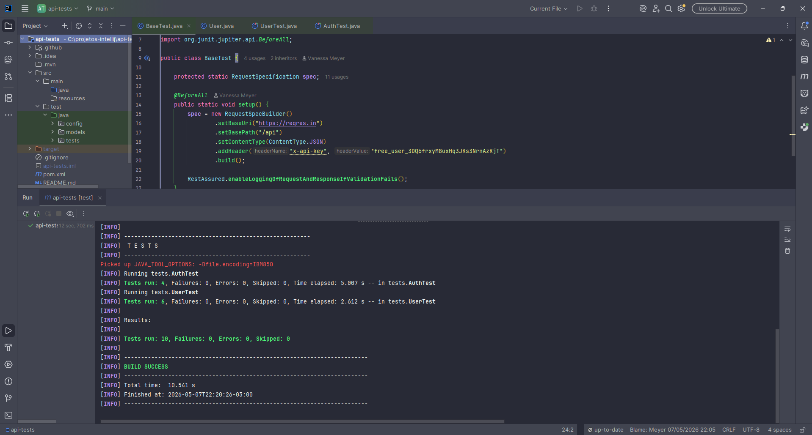

# 🧪 API Tests — ReqRes



Projeto de testes automatizados de API REST utilizando RestAssured + Java + JUnit 5, com CI/CD via GitHub Actions.

## ✅ Cobertura de Testes

### Usuários (`/users`)
- GET lista de usuários — status 200 e dados válidos
- GET usuário por ID — dados corretos
- GET usuário inexistente — status 404
- POST criar usuário — status 201
- PUT atualizar usuário — status 200
- DELETE usuário — status 204

### Autenticação (`/login` e `/register`)
- POST login com sucesso — token retornado
- POST login sem senha — erro 400
- POST register com sucesso — id e token
- POST register sem senha — erro 400

## 🛠️ Stack

| Ferramenta | Versão |
|---|---|
| Java | 17 |
| RestAssured | 5.4.0 |
| JUnit 5 | 5.10.0 |
| Maven | 3.x |

## 🚀 Como executar

```bash
git clone https://github.com/elizyr/api-tests.git
cd api-tests
mvn test
```

## 📊 CI/CD

Pipeline configurado com GitHub Actions — executa automaticamente a cada `push` ou `pull request` na branch `main` e publica o relatório de testes como artefato.
